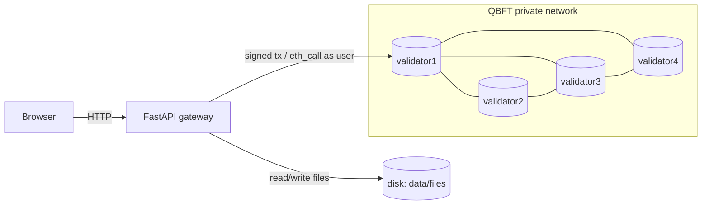

# Class Ledger on a Private Blockchain

A minimal system that stores and shares one class's **lectures, labs, exams,
corrections and grades** on a private, permissioned blockchain, enforcing four
access rules directly in a smart contract.

- **Blockchain:** Hyperledger Besu, 4 validators, **QBFT** consensus (tolerates 1 failure).
- **Smart contract:** `ClassLedger.sol` (Solidity) — holds the data model and all access rules.
- **App:** Python **FastAPI** + Jinja2, server-rendered, talks to a node over internal RPC.
- **Files:** stored on the server disk; only their **SHA-256** and metadata go on-chain.
- **Hosting:** one Azure Ubuntu VM with Docker Compose.

## The four access rules

| # | Rule | Where enforced |
|---|------|----------------|
| 1 | Class description & organization are **public** | `classDescription` / `classOrganization` |
| 2 | Lectures & labs → **enrolled students only** | `getFile` / `getMeta` check `isEnrolled` |
| 3 | Exams & corrections → enrolled, and **24 h after the exam date** | `now >= examAt + 24h` |
| 4 | Each student sees **only their own grade** | `myGrade` / `gradeOf` gate on `msg.sender` |

Immutability: nothing is updated or deleted; a correction is a **new version** that
links to the previous one.

## Architecture



Reads carry the user's address as `msg.sender` via `eth_call`, so the **contract**
decides visibility; the gateway only mirrors the result and keeps the RPC private.

## Prerequisites

- Docker + Docker Compose v2
- (Only to re-compile the contract) Python 3.11+ and internet for `solc`

## Quickstart (local)

```bash
make up        # generates QBFT keys, builds the app, starts 4 validators + API
make deploy    # deploys ClassLedger and records its address
make seed      # enrolls the 2 demo students and adds a sample lecture
```

Open <http://localhost:8000/>.

Demo accounts (web logins only): `teacher` / `student1` / `student2`
(passwords in `.env`, defaults `teacher` / `student1` / `student2`).

Stop or reset:

```bash
make down      # stop containers
make clean     # stop and delete generated keys + chain data
```

## Tests

```bash
make test      # 7 rule/integrity tests on an in-process EVM (fast, no Besu needed)
make smoke     # end-to-end on the running stack (needs make up + make deploy)
```

`make test` covers the four rules plus append-only revisions. `make smoke` logs in
as teacher and student over HTTP, checks the 24 h lock, grade privacy, and a
hash-verified download.

## Deploy on Azure

One Ubuntu VM, Docker Compose, HTTP on port 80.

```bash
az login
scripts/azure/up.sh       # create the VM (Docker via cloud-init)
scripts/azure/deploy.sh   # copy the repo, start, deploy, seed
# ... demo at http://<vm-ip>/ ...
scripts/azure/stop.sh     # deallocate the VM (stops compute billing)
scripts/azure/destroy.sh  # delete everything
```

The first deploy generates random web passwords and saves them locally in
`scripts/azure/.demo_credentials` (git-ignored). Add an email threshold to the
created `classledger-budget` in Azure Cost Management. HTTP is intentionally
limited to this short-lived demo; do not use real student data or passwords.

The four validators run as four containers on this single VM — cost-effective for
a demo, not a production topology (which would spread them across hosts/orgs).

## Configuration

Copy `.env.example` to `.env` (done automatically by `make up`). Keys there are
**public Besu test accounts**, safe only because this is an isolated zero-gas
chain. The teacher is the only account that signs transactions.

| Variable | Meaning |
|----------|---------|
| `RPC_URL` | Node RPC the gateway uses (internal) |
| `TEACHER_ADDRESS` / `TEACHER_PRIVATE_KEY` | The only writer |
| `STUDENT1_ADDRESS` / `STUDENT2_ADDRESS` | Enrolled readers |
| `WEB_PORT` | Published web port (80 on Azure) |
| `SESSION_SECRET` | Signed-cookie secret |

## Limitations (by design)

- Confidentiality is enforced by the gateway + a non-public RPC. **Any node
  operator can read raw chain state** — inherent to blockchains; documented in the report.
- One class, one teacher, two demo students. No notifications, payments, tokens, or SSO.
- Demo validators share a single VM.

## Layout

```
app/            FastAPI gateway (auth, chain, files, templates)
contracts/      ClassLedger.sol + compiled artifact
network/        Docker Compose + QBFT config
scripts/        network generation, smoke test, Azure scripts
tests/          contract-rule tests
docs/           French report, slides, demo runbook
```
