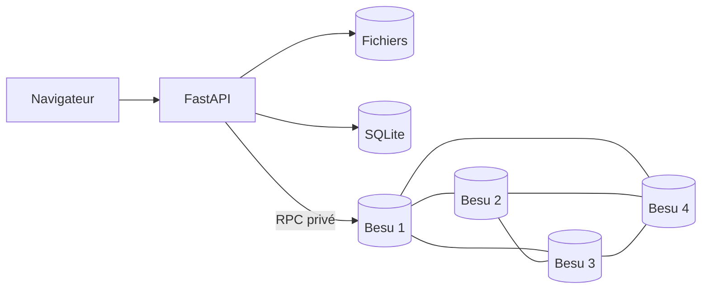

# ClassLedger

Registre de classe sur une blockchain privée **Hyperledger Besu**.

Le projet permet à un enseignant de publier des cours, TP, examens, corrections
et notes, avec des règles d'accès appliquées directement par un smart contract.

**Version : contrat V4.** Documentation revue le 9 septembre 2026 ; dernière
campagne complète locale et Azure réussie le 9 septembre 2026.

## Lancer le projet

### Prérequis

- Git
- Docker Desktop ou Docker Engine
- Docker Compose v2
- Make

Docker doit être démarré avant de continuer.

### Installation

```bash
git clone https://github.com/Sphertana/blockchainProject.git
cd blockchainProject
make demo
```

`make demo` fait tout automatiquement : génération du réseau, construction des
images, démarrage des 4 validateurs, déploiement du contrat et ajout des données
de démonstration. Un contrat V4 compatible est réutilisé ; les données existantes
ne sont pas remises à zéro.

Le premier lancement peut prendre quelques minutes.

Ouvrir ensuite : **<http://localhost:8000/>**

### Comptes de démonstration

| Rôle | Identifiant | Mot de passe |
|---|---|---|
| Enseignant | `teacher` | `teacher` |
| Étudiant 1 | `student1` | `student1` |
| Étudiant 2 | `student2` | `student2` |

Valeurs locales par défaut uniquement. Les identifiants Azure sont distincts ;
les nouveaux comptes étudiants demandent un mot de passe de 12 caractères minimum.

Vérifier que l'application répond :

```bash
curl http://localhost:8000/health
```

Résultat attendu :

```json
{"rpc":true,"contract":"0x..."}
```

Vérifier le JSON, pas seulement le statut HTTP : `/health` peut répondre 200 avec
`rpc: false`. Une adresse non nulle ne remplace pas les tests métier.

## Ce que montre la démonstration

| Règle | Comportement |
|---|---|
| Informations publiques | la description et l'organisation sont visibles sans connexion |
| Cours et TP | accessibles uniquement aux étudiants inscrits |
| Examens et corrections | accessibles aux inscrits 24 h après l'examen |
| Notes | chaque étudiant ne voit que sa propre note |
| Immutabilité V4 | documents, informations de classe et notes conservent leurs anciennes versions |

L'enseignant accède à ses documents et aux notes des inscrits. Le délai de 24 h
vise les étudiants et se calcule depuis la date d'examen ; une correction hérite
de cette date. L'interface montre la dernière note, l'historique reste dans le contrat.

### Parcours conseillé

1. Ouvrir l'accueil sans se connecter : les informations publiques apparaissent.
2. Créer un nouveau compte étudiant et demander l'inscription.
3. Se connecter comme `teacher` et approuver la demande.
4. Publier un cours, puis un examen daté du jour.
5. Publier une note pour `student1`.
6. Se connecter comme `student1` : le cours et sa note sont visibles, l'examen est verrouillé.
7. Se connecter comme `student2` : la note de `student1` reste invisible.
8. Ouvrir **Preuve chaîne** pour voir les blocs, les pairs et les validateurs.

## Tester le projet

Après `make demo`, lancer toute la campagne :

```bash
make verify
```

Cette commande exécute :

- **24 tests** du contrat, de sécurité et de rendu, dont les historiques V4 sans écrasement ;
- un parcours E2E complet par HTTP ;
- la vérification P2P des 4 copies de la chaîne ;
- le consensus QBFT avec 3 validateurs sur 4 ;
- le blocage du consensus avec seulement 2 validateurs ;
- le rattrapage des nœuds après redémarrage ;
- la détection d'un fichier falsifié ;
- le chiffrement des notes stockées sur la chaîne.

Les suites peuvent aussi être lancées séparément :

```bash
make test        # contrat et sécurité
make smoke       # parcours E2E
make compliance  # réplication P2P et consensus QBFT
```

Les tests E2E ajoutent des données fictives et la conformité arrête temporairement
des validateurs. Prévoir cette campagne avant la démonstration. Les tests du
contrat utilisent un EVM en mémoire ; smoke et conformité utilisent les vrais Besu.

## Commandes utiles

| Commande | Utilité |
|---|---|
| `make demo` | lancer toute la démonstration |
| `make ps` | voir l'état des conteneurs |
| `make logs` | suivre les journaux |
| `make verify` | exécuter tous les tests |
| `make down` | arrêter sans perdre les données |
| `make up` | reprendre après un arrêt |
| `make clean` | supprimer volumes et clés réseau, sans supprimer le dossier applicatif `data/` |
| `make help` | afficher toutes les commandes |

## Architecture



- **Blockchain :** Hyperledger Besu, 4 validateurs, consensus QBFT.
- **Contrat :** Solidity V4, règles d'accès et publications append-only.
- **Application :** FastAPI et pages Jinja2.
- **Fichiers :** sur disque ; métadonnées, référence et SHA-256 ancrés sur la chaîne.
- **Notes :** chiffrées en AES-256-GCM avant leur écriture on-chain.
- **Comptes :** mots de passe Argon2 et keystores Ethereum chiffrés.

Créer un compte est une opération SQLite hors chaîne. La passerelle signe ensuite
la demande avec la clé de l'étudiant, puis décisions et publications avec la clé
enseignante : les portefeuilles sont custodiaux. Les lectures `eth_call` ne sont
pas signées ; leur champ `from` est choisi depuis la session web. Le RPC privé et
le chiffrement des notes sont essentiels : ce champ seul n'authentifie pas un lecteur.

Sur Azure, Caddy assure HTTPS entre le navigateur et l'API. Les quatre copies de
la chaîne sont détenues par les validateurs, pas par chaque étudiant. Le réseau
local et celui d'Azure sont indépendants, même si leurs contrats ont la même adresse.

## Déploiement Azure

Azure est utilisé uniquement pour rendre la démonstration accessible sur
Internet. Le projet fonctionne entièrement en local sans Azure.

### Première création

Prérequis : Azure CLI, un abonnement Azure, SSH et `rsync`.

```bash
az login
scripts/azure/up.sh
scripts/azure/deploy.sh
```

Les scripts créent une VM Ubuntu, installent Docker, attribuent un nom DNS,
activent HTTPS avec Caddy, déploient le projet et exécutent le smoke test.

Afficher le nom DNS Azure :

```bash
cat scripts/azure/.vm_host
```

Les mots de passe sont sauvegardés dans `scripts/azure/.demo_credentials`, privé,
mode 600 et ignoré par Git. Ne pas l'afficher pendant un partage d'écran.

### Redémarrer la VM existante

```bash
az login
az vm start -g classledger-rg -n classledger-vm
```

Les conteneurs existants redémarrent via `restart: unless-stopped`. Attendre leur
disponibilité puis vérifier que le JSON indique `rpc: true` et un contrat non nul :

```bash
curl "https://$(cat scripts/azure/.vm_host)/health"
```

Pour envoyer une nouvelle version du code :

```bash
scripts/azure/deploy.sh
```

Un simple redémarrage de VM ne nécessite pas de redéploiement. Un changement de
contrat incompatible crée une nouvelle adresse sans migration automatique de
l'ancien historique. Pour une recette Azure, exécuter les tests sur la VM.

### Arrêter les frais de calcul

```bash
scripts/azure/stop.sh
```

Cette commande désalloue la VM et arrête la facturation du compute. Le disque et
l'IP publique restent conservés et facturables. Le tarif de calcul observé est
de 0,0944 USD/h pour B2ms Linux en France Central, hors disque/IP. Le budget de
10 EUR/mois avec alerte à 80 % ne bloque pas les dépenses ; l'arrêt automatique
est configuré à 23 h UTC. La couverture par des crédits doit être vérifiée dans
l'abonnement, pas supposée.

Suppression définitive de toutes les ressources :

```bash
scripts/azure/destroy.sh
```

## Sécurité et limites

- HTTPS, HSTS, CSP, cookies sécurisés et protection CSRF sur Azure.
- RPC et ports P2P non exposés publiquement.
- Vérification SHA-256 à chaque téléchargement.
- Notes chiffrées avant stockage sur la blockchain.
- Les 4 validateurs sont des conteneurs distincts, mais partagent une seule
  machine physique : la distribution est logique, pas géographique.
- La gateway conserve les clés chiffrées des étudiants et la clé de
  déchiffrement des notes ; son opérateur reste donc une autorité de confiance.
- Une panne de `validator1` peut laisser le consensus fonctionner à trois, mais
  rend le RPC unique de l'application indisponible.
- Les clés Ethereum préchargées sont publiques et réservées aux tests ; ni
  Solidity `private` ni une session signée ne chiffrent les données par eux-mêmes.
- Le système est une démonstration monoclasse, pas un ENT de production.

Utiliser uniquement des données fictives.

## En cas de problème

### Docker ne répond pas

Démarrer Docker Desktop, puis relancer :

```bash
make demo
```

### Un conteneur n'est pas sain

```bash
make ps
make logs
```

Les 4 validateurs et `classledger-api` doivent être `healthy`.

### Le port 8000 est occupé

Modifier uniquement `WEB_PORT=8080` dans le fichier `.env` existant, relancer
`make demo`, puis ouvrir <http://localhost:8080/>. Ne pas écraser `.env` avec
l'exemple : cela remplacerait les secrets associés aux données existantes.

### Repartir de zéro

**Destructif, uniquement pour une démonstration locale jetable.** Sauvegarder les
données et secrets avant ces commandes : elles effacent la chaîne, les clés réseau,
les volumes nommés (dont les certificats Caddy), les comptes, les keystores et les
fichiers. Ne pas les utiliser pour un simple redémarrage ou dépannage de connexion.

```bash
make clean
rm -rf data
make demo
```

## Documentation

- [Rapport technique PDF](docs/report/rapport-technique.pdf) : livrable final, seul PDF suivi par Git.

Seul ce README est versionné parmi les fichiers Markdown. Les sources du rapport,
la soutenance, le runbook et le guide personnel restent locaux et ignorés par Git.
Tous les autres PDF sont également ignorés, même dans les sous-dossiers.