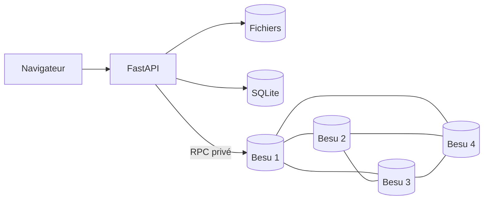

# ClassLedger

Registre de classe sur une blockchain privée **Hyperledger Besu**.

Le projet permet à un enseignant de publier des cours, TP, examens, corrections
et notes, avec des règles d'accès appliquées directement par un smart contract.

## Lancer le projet

### Prérequis

- Git
- Docker Desktop ou Docker Engine
- Docker Compose v2
- Make

Docker doit être démarré avant de continuer.

### Installation

```bash
git clone https://github.com/Sphertana/blockchainProject.git
cd blockchainProject
make demo
```

`make demo` fait tout automatiquement : génération du réseau, construction des
images, démarrage des 4 validateurs, déploiement du contrat et ajout des données
de démonstration.

Le premier lancement peut prendre quelques minutes.

Ouvrir ensuite : **<http://localhost:8000/>**

### Comptes de démonstration

| Rôle | Identifiant | Mot de passe |
|---|---|---|
| Enseignant | `teacher` | `teacher` |
| Étudiant 1 | `student1` | `student1` |
| Étudiant 2 | `student2` | `student2` |

Vérifier que l'application répond :

```bash
curl http://localhost:8000/health
```

Résultat attendu :

```json
{"rpc":true,"contract":"0x..."}
```

## Ce que montre la démonstration

| Règle | Comportement |
|---|---|
| Informations publiques | la description et l'organisation sont visibles sans connexion |
| Cours et TP | accessibles uniquement aux étudiants inscrits |
| Examens et corrections | accessibles aux inscrits 24 h après l'examen |
| Notes | chaque étudiant ne voit que sa propre note |
| Immutabilité | une correction crée une nouvelle version sans effacer l'ancienne |

### Parcours conseillé

1. Ouvrir l'accueil sans se connecter : les informations publiques apparaissent.
2. Créer un nouveau compte étudiant et demander l'inscription.
3. Se connecter comme `teacher` et approuver la demande.
4. Publier un cours, puis un examen daté du jour.
5. Publier une note pour `student1`.
6. Se connecter comme `student1` : le cours et sa note sont visibles, l'examen est verrouillé.
7. Se connecter comme `student2` : la note de `student1` reste invisible.
8. Ouvrir **Preuve chaîne** pour voir les blocs, les pairs et les validateurs.

## Tester le projet

Après `make demo`, lancer toute la campagne :

```bash
make verify
```

Cette commande exécute :

- **19 tests** du contrat et de sécurité ;
- un parcours E2E complet par HTTP ;
- la vérification P2P des 4 copies de la chaîne ;
- le consensus QBFT avec 3 validateurs sur 4 ;
- le blocage du consensus avec seulement 2 validateurs ;
- le rattrapage des nœuds après redémarrage ;
- la détection d'un fichier falsifié ;
- le chiffrement des notes stockées sur la chaîne.

Les suites peuvent aussi être lancées séparément :

```bash
make test        # contrat et sécurité
make smoke       # parcours E2E
make compliance  # réplication P2P et consensus QBFT
```

Les tests E2E ajoutent des données. Pour revenir à la démonstration initiale :

```bash
make clean
rm -rf data
make demo
```

## Commandes utiles

| Commande | Utilité |
|---|---|
| `make demo` | lancer toute la démonstration |
| `make ps` | voir l'état des conteneurs |
| `make logs` | suivre les journaux |
| `make verify` | exécuter tous les tests |
| `make down` | arrêter sans perdre les données |
| `make up` | reprendre après un arrêt |
| `make clean` | supprimer la chaîne locale |
| `make help` | afficher toutes les commandes |

## Architecture



- **Blockchain :** Hyperledger Besu, 4 validateurs, consensus QBFT.
- **Contrat :** Solidity, règles d'accès et données immuables.
- **Application :** FastAPI et pages Jinja2.
- **Fichiers :** conservés sur disque ; seul leur SHA-256 est ancré sur la chaîne.
- **Notes :** chiffrées en AES-256-GCM avant leur écriture on-chain.
- **Comptes :** mots de passe Argon2 et keystores Ethereum chiffrés.

L'étudiant signe sa demande d'inscription. L'enseignant signe son approbation et
les publications. Les lectures utilisent l'adresse de l'utilisateur comme
`msg.sender`, afin que le contrat décide lui-même de l'accès.

## Déploiement Azure

Azure est utilisé uniquement pour rendre la démonstration accessible sur
Internet. Le projet fonctionne entièrement en local sans Azure.

### Première création

Prérequis : Azure CLI, un abonnement Azure, SSH et `rsync`.

```bash
az login
scripts/azure/up.sh
scripts/azure/deploy.sh
```

Les scripts créent une VM Ubuntu, installent Docker, attribuent un nom DNS,
activent HTTPS avec Caddy, déploient le projet et exécutent le smoke test.

Afficher l'adresse et les mots de passe Azure :

```bash
cat scripts/azure/.vm_host
cat scripts/azure/.demo_credentials
```

Ces fichiers sont privés et ignorés par Git.

### Redémarrer la VM existante

```bash
az login
az vm start -g classledger-rg -n classledger-vm
```

Attendre environ une minute puis vérifier :

```bash
curl "https://$(cat scripts/azure/.vm_host)/health"
```

Pour envoyer une nouvelle version du code :

```bash
scripts/azure/deploy.sh
```

### Arrêter les frais de calcul

```bash
scripts/azure/stop.sh
```

Cette commande désalloue la VM et arrête la facturation du compute. Le disque et
l'IP publique restent conservés et peuvent encore entraîner un faible coût.

Suppression définitive de toutes les ressources :

```bash
scripts/azure/destroy.sh
```

## Sécurité et limites

- HTTPS, HSTS, CSP, cookies sécurisés et protection CSRF sur Azure.
- RPC et ports P2P non exposés publiquement.
- Vérification SHA-256 à chaque téléchargement.
- Notes chiffrées avant stockage sur la blockchain.
- Les 4 validateurs sont des conteneurs distincts, mais partagent une seule
  machine physique : la distribution est logique, pas géographique.
- La gateway conserve les clés chiffrées des étudiants et la clé de
  déchiffrement des notes ; son opérateur reste donc une autorité de confiance.
- Le système est une démonstration monoclasse, pas un ENT de production.

Utiliser uniquement des données fictives.

## En cas de problème

### Docker ne répond pas

Démarrer Docker Desktop, puis relancer :

```bash
make demo
```

### Un conteneur n'est pas sain

```bash
make ps
make logs
```

Les 4 validateurs et `classledger-api` doivent être `healthy`.

### Le port 8000 est occupé

```bash
cp .env.example .env
```

Modifier `WEB_PORT=8080` dans `.env`, relancer `make demo`, puis ouvrir
<http://localhost:8080/>.

### Repartir de zéro

```bash
make clean
rm -rf data
make demo
```

## Documentation

- [Scénario de démonstration](docs/demo/runbook.md)
- [Rapport technique](docs/report/)
- [Présentation](docs/presentation/)

Dernière recette complète : **7 septembre 2026** — tests locaux et Azure HTTPS
réussis, 4 validateurs, 3 pairs par nœud et consensus QBFT vérifié.